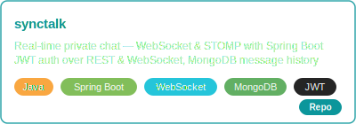
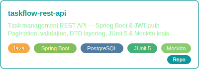
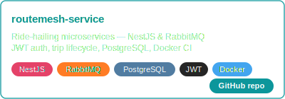

 

&nbsp;

## Profile

* Software Engineer with nearly 2 years of experience building backend systems and RESTful APIs in production environments.

* Worked as a Full-stack Developer with a primary focus on backend development using PHP (Zend/Laminas) and relational databases.

* Currently focusing on Java backend development with Spring Boot, Spring Security, JPA, and WebSocket.

## Tech Stack

## Featured Projects

## Current Focus

|  |  |  |
|:---:|:---:|:---:|
| **OOP & Design Patterns** | **SQL & Performance** | **Security & Auth** |
| SOLID · Design patterns · Clean architecture | Query tuning · Indexing · MySQL · PostgreSQL | JWT flows · SQL injection · Prepared statements |

## GitHub Stats

## Contact

