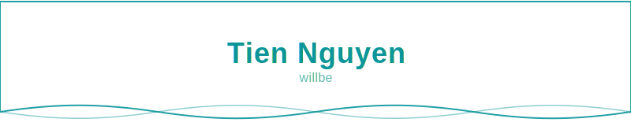
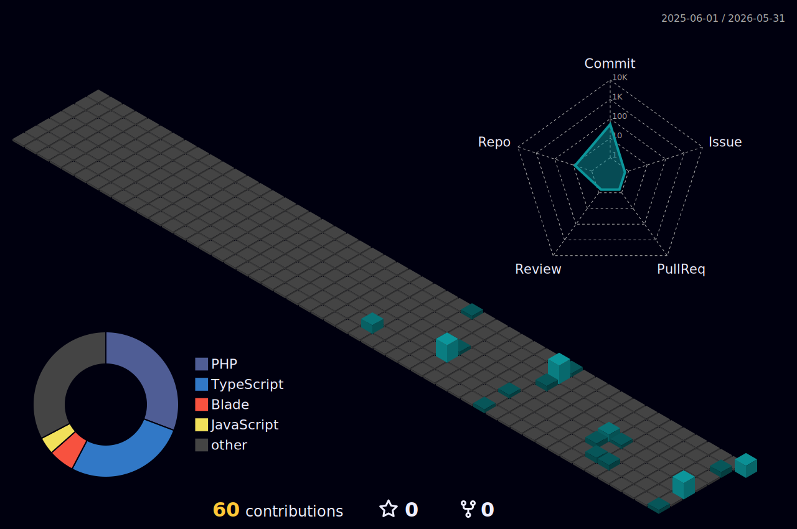
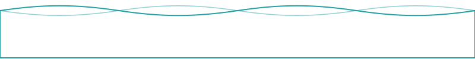

 

&nbsp;

---

## Profile

* Fullstack Developer building web applications and RESTful APIs in production environments.

* Working primarily with PHP (Zend/Laminas) and MySQL, with a focus on backend development, system maintenance, and database performance.

* Apply OOP principles, SOLID practices, and design patterns where appropriate to build maintainable systems and support long-term product growth.

---

## Tech Stack

---

## GitHub Stats

  

<picture>
  <source media="(prefers-color-scheme: dark)" srcset="./profile-3d-contrib/profile-night-green.svg" />
  <source media="(prefers-color-scheme: light)" srcset="./profile-3d-contrib/profile-green.svg" />
  
</picture>

---

## Featured Projects

### [devflow-platform](https://github.com/ngtn-tiennguyen/devflow-platform)

Developer workflow platform — JWT auth, real-time WebSocket, BullMQ job queue, AI-powered log analysis, Swagger UI, Docker.

### [zend-highlands-coffee-mvc](https://github.com/ngtn-tiennguyen/zend-highlands-coffee-mvc)

Coffee shop management system built with Zend Framework MVC — menu, orders, and inventory with MySQL.

---

## Current Focus

|  |  |  |
|:---:|:---:|:---:|
| **OOP & Design Patterns** | **SQL & Performance** | **Security & Auth** |
| SOLID · Design patterns · Clean architecture | Query tuning · Indexing · MySQL · PostgreSQL | JWT flows · SQL injection · Prepared statements |

---

## Contact

