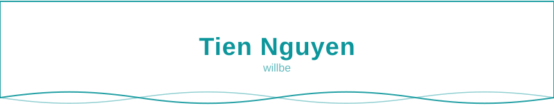
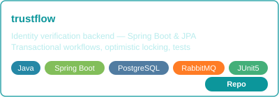
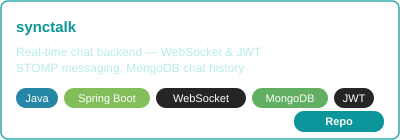
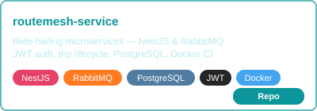
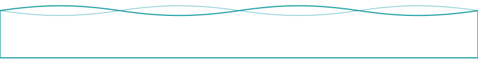

 

&nbsp;

## Profile

* Software Engineer with two years of experience building backend systems and RESTful APIs in production environments.

* Worked as a Software Developer with a primary focus on backend development using PHP (Zend Framework) and relational databases.

* Currently focusing on Java backend development with Spring Boot, Spring Security, JPA, and WebSocket.

## Tech Stack

-010101?style=for-the-badge&logo=socketdotio&logoColor=white)

## Featured Projects

## Current Focus

|  |  |  |
|:---:|:---:|:---:|
| **OOP & Design Patterns** | **Microservices & Events** | **Security & Auth** |
| SOLID · Design patterns · Clean architecture | RabbitMQ · Event-driven design · Docker | JWT flows · Testcontainers · Prepared statements |

## Contact

